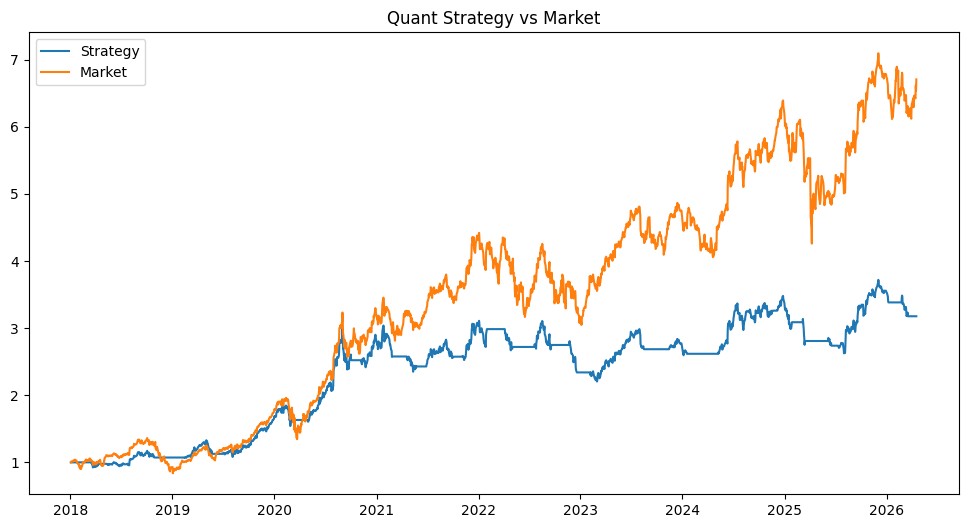

# Quantitative Trading & Risk Management System

This project uses real market data to build a trading strategy and evaluate performance.

## What this project does
- Downloads real stock data
- Builds a simple trading strategy (moving average)
- Compares strategy performance vs market

## Strategy Performance

